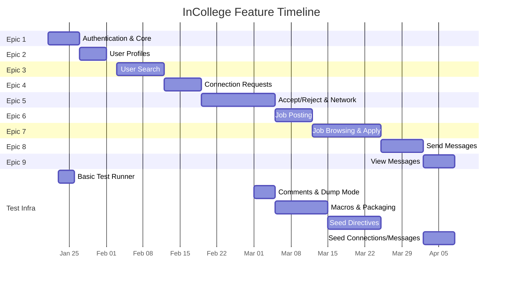
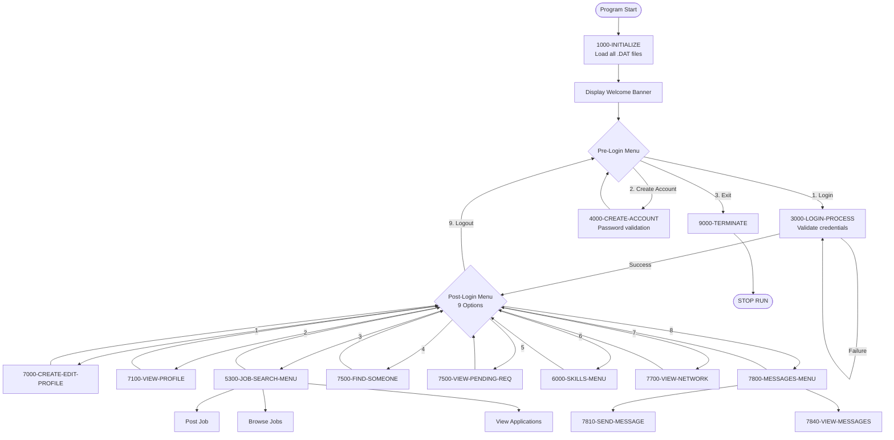
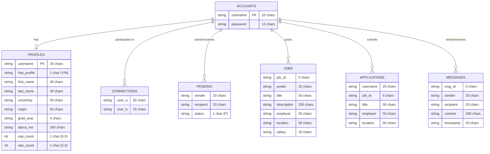
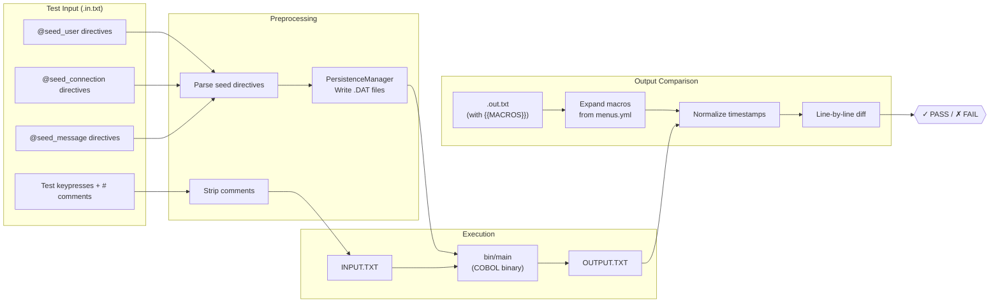

# InCollege Final Presentation — Master Plan

> **Purpose:** This document is the authoritative outline for building the final presentation slides. Every section maps to a slide group. Commit hashes, dates, file paths, and code patterns are cited so that downstream agents can reconstruct the narrative without re-exploring the repo.

---

## Table of Contents

1. [Part A — How We Work: Agile at a Glance](#part-a--how-we-work-agile-at-a-glance)
2. [Part B — Building InCollege: A Chronological Story](#part-b--building-incollege-a-chronological-story)
   - [Milestone 1: Project Bootstrap & Epic 1 — Authentication](#milestone-1-project-bootstrap--epic-1--authentication-jan-21--jan-27)
   - [Milestone 2: Epic 2 — User Profiles](#milestone-2-epic-2--user-profiles-feb-1)
   - [Milestone 3: Epic 3 — User Search & Profile Viewing](#milestone-3-epic-3--user-search--profile-viewing-feb-12)
   - [Interlude A: The Test Runner](#interlude-a-the-test-runner-jan-23--feb-19)
   - [Milestone 4: Epic 4 — Connection Requests](#milestone-4-epic-4--connection-requests-feb-19)
   - [Milestone 5: Epic 5 — Accept/Reject Connections & Network](#milestone-5-epic-5--acceptreject-connections--network-mar-5)
   - [Interlude B: Macros, Seed Directives & Packaging](#interlude-b-macros-seed-directives--packaging-mar-5--mar-25)
   - [Milestone 6: Epic 6 — Job Posting](#milestone-6-epic-6--job-posting-mar-12)
   - [Milestone 7: Epic 7 — Job Browsing & Applications](#milestone-7-epic-7--job-browsing--applications-mar-25)
   - [Interlude C: The Great Modularization](#interlude-c-the-great-modularization-apr-2)
   - [Milestone 8: Epic 8 — Send Messages](#milestone-8-epic-8--send-messages-apr-2)
3. [Part C — Epic 9 Deep Dive: View Messages](#part-c--epic-9-deep-dive-view-messages)
4. [Part D — Architecture & Design Patterns](#part-d--architecture--design-patterns)
5. [Part E — Closing](#part-e--closing)
6. [Appendix — Diagrams](#appendix--diagrams)

---

## Part A — How We Work: Agile at a Glance

### Content

1. **Epics, Stories, Subtasks** — Define the hierarchy used throughout the semester.
   - **Epic** = a major functionality (e.g., "Job Posting", "Messaging").
   - **Story** = a user-visible feature within an epic (e.g., "As a user, I can post a job with a title, description, employer, location, and optional salary").
   - **Subtask** = an implementation or testing unit (e.g., "Implement salary validation", "Write test for blank description re-prompt").

2. **Rotating Scrum Master** — Every epic had a different Scrum Master. Show the rotation:

   | Epic | Scrum Master | Coder 1 | Coder 2 | Tester 1 | Tester 2 |
   |------|-------------|---------|---------|----------|----------|
   | 1 | Trevor | Aaron | Olga | Melaine | Victoria |
   | 2 | Melaine | Victoria | Trevor | Aaron | Olga |
   | 3 | Victoria | Trevor | Aaron | Olga | Melaine |
   | 4 | Trevor | Aaron | Olga | Melaine | Victoria |
   | 5 | Aaron | Olga | Melaine | Victoria | Trevor |
   | 6 | Olga | Melaine | Victoria | Trevor | Aaron |
   | 7 | Melaine | Victoria | Trevor | Aaron | Olga |
   | 8 | Victoria | Trevor | Aaron | Olga | Melaine |
   | 9 | *(entire team — final epic)* | | | | |

3. **Branching Strategy** — Feature branches per epic:
   - `impl/<feature>` for implementation
   - `test/<feature>` for test development
   - PRs merge test → impl → main
   - Example from Epic 5: `impl/connection_management`, `test/connection_management` → PR #18 → `main`

4. **How we tackled new features** — For each epic the coders would branch off `main`, implement features, while testers simultaneously wrote test fixtures on a parallel branch. Test branches merged into impl branches, impl branches merged into main via PR. CI ran on every push.

### Key Artifacts to Show
- The role rotation table above
- A screenshot or diagram of the branching model
- The PR merge pattern (test → impl → main)

---

## Part B — Building InCollege: A Chronological Story

This is the heart of the presentation. Each milestone tells what was built, cites the commits, and briefly touches on testing — but testing is NOT the focus of every milestone. Instead, test infrastructure improvements are called out as dedicated **Interludes** between milestones.

---

### Milestone 1: Project Bootstrap & Epic 1 — Authentication (Jan 21 – Jan 27)

#### What Was Built

The foundation of the entire application:
- **DevContainer & CI** — Dockerfile with GnuCOBOL, GitHub Actions build workflow
- **Core COBOL Program** (`src/main.cob`) — The monolithic starting point
- **Account Creation** — Username + password with validation rules:
  - 8–12 characters, at least 1 uppercase, 1 digit, 1 special character (`!@#$%^&*`)
- **Login** — Credential matching against `ACCOUNTS.DAT`, unlimited retry on failure
- **Account Limit** — Maximum 5 accounts enforced
- **Persistence** — `ACCOUNTS.DAT` file survives across program runs
- **Skills Menu** — Placeholder "Learn a New Skill" submenu
- **EOF Handling** — Graceful termination when input stream exhausts

#### Key Commits (chronological)

| Hash | Date | Description |
|------|------|-------------|
| `8d19aed` | Jan 21 | **Initial commit** — Dockerfile, devcontainer, build.yml, main.cob skeleton (8 files, 172 lines) |
| `f5dc321` | Jan 21 | Add Epic #1 deliverable PDF |
| `53c053a` | Jan 21 | Fix Ubuntu-related COBOL compiler issues for GH workflow |
| `5ba8fc9` | Jan 23 | **Add test infrastructure** — test_runner.py, fixtures, run_tests.sh (26 files, 1875 lines) |
| `b2f3763` | Jan 24 | **Epic #1 stories 1–4 implementation** — The core COBOL program by Viktoria (516 lines added to main.cob) |
| `59e8dea` | Jan 25 | **Refactor test runner for file-based I/O** — GH Actions CI, expected output files (52 files, 1179 insertions) |
| `23ea1d4` | Jan 26 | Password validation, menu text, infinite loop fix — all 18 tests pass |
| `4c1b395` | Jan 26 | **Merge PR #3** — Stable Epic #1 into main |
| `e8ad1db` | Jan 26 | **Merge PR #4** — EOF handling fixes |

#### How It Was Tested

This is where testing is introduced for the first time in the presentation:
- **18 test fixtures** (running total: **18**) covering: login success/failure, account creation, password validation, EOF at every menu point
- Tests are simple `.in.txt` / `.out.txt` file pairs — input is piped into the COBOL binary via `INPUT.TXT`, output compared line-by-line against expected `OUTPUT.TXT`
- The test runner (`test_runner.py`) was born here — a Python script that discovers fixtures, runs the binary, and diffs output

#### Architecture at This Point

```
src/main.cob          (~520 lines, monolithic)
ACCOUNTS.DAT          (persistent storage)
tests/test_runner.py  (basic runner)
tests/fixtures/       (18 test pairs)
```

---

### Milestone 2: Epic 2 — User Profiles (Feb 1)

#### What Was Built

- **Profile Creation** — Required fields: first name, last name, university, major, graduation year
- **Optional Fields** — About Me (max 200 chars), up to 3 work experiences, up to 3 education entries
- **Profile Viewing** — Display complete profile with all fields
- **Profile Editing** — Update existing profile data
- **Profile Persistence** — `PROFILES.DAT` file (fixed-width records, 1206 bytes each)
- **Graduation Year Validation** — Must be 4 digits, 1950–2050

#### Key Commits

| Hash | Date | Description |
|------|------|-------------|
| `9a2e4f8` | Jan 27 | Move epics to `/epics`, add Epic #2 PDF |
| `c7a84cb` | Feb 1 | **Major commit** — About Me, missing fields validation, profile CRUD (91 files, 4749 insertions). `main.cob` grows to ~1220 lines |
| `2c25938` | Feb 1 | Fix About Me to actually enforce 200-char max |
| `1b5225c` | Feb 1 | Update all 28 test fixtures for new education/experience prompts |
| `275594b` | Feb 1 | Increase OUTPUT-RECORD to 500 chars for long profile fields |

#### How It Was Tested (brief)
- Existing 18 tests updated for new menu structure + new fixtures added (running total: **~28**)
- New fixtures for: profile creation, editing, viewing, graduation year validation, long text, persistence across logins, special characters
- Still using basic `.in.txt` / `.out.txt` pairs — no macros yet

#### Architecture Growth

`main.cob` is now **~1220 lines** — still monolithic. Two `.DAT` files: `ACCOUNTS.DAT` + `PROFILES.DAT`.

---

### Milestone 3: Epic 3 — User Search & Profile Viewing (Feb 12)


#### What Was Built

- **Find Someone You Know** — Search for users by full name (first + last)
- **Search Results** — Display found user's complete profile
- **Not Found Handling** — Informative message when no match
- **Menu Integration** — Accessible as main menu option #4

#### Key Commits

| Hash | Date | Description |
|------|------|-------------|
| `40ee37d` | Feb 3 | Add Epic #3 requirements PDF |
| `c5cad5e` | ~Feb 10 | Implement basic user search by full name |
| `0e521ba` | ~Feb 10 | Enhance search with first and last name support |
| `4e82b98` | Feb 12 | **Merge PR #7** — Epic #3 into main (42 files, 2399 insertions) |
| `5429c98` | Feb 12 | Streamline test execution, enhance test directory discovery |

#### Testing Note
- 30+ new test fixtures (running total: **~58**): profile viewing (long text, blanks, persistence), search (found, not found, after edit, EOF)
- `JIRA_TASK_MAPPING.md` added — maps test fixtures to JIRA stories

---

### Interlude A: The Test Runner (Jan 23 – Feb 19)


> *"The tests were becoming hard to manage manually. So we built a real test runner."*

This interlude explains how the test infrastructure evolved from a simple script to a sophisticated system. It should be placed here because by Epic 3, the team had ~50+ test fixtures and the manual approach was hitting limits.

#### Phase 1: Birth (Jan 23) — `5ba8fc9`
- `test_runner.py` created — discovers test directories, runs COBOL binary, compares output
- `run_tests.sh` shell wrapper
- GitHub Actions CI runs tests on every push
- Basic structure: `tests/fixtures/<category>/<test>/inputs/*.in.txt` + `expected/*.out.txt`

#### Phase 2: File-Based I/O Refactor (Jan 25) — `59e8dea`
- Major rewrite (52 files, 1179 insertions)
- Tests use `INPUT.TXT` → COBOL binary → `OUTPUT.TXT` pattern
- Unified diff generation for failures (color-coded)
- Test discovery made recursive

#### Phase 3: Comments in Test Files (Mar 5) — `86e361d`
- Inline comments (`# comment`) and full-line comments supported in `.in.txt` files
- Escaped hashes (`\#`) for literal `#` in input
- Made test files self-documenting:
  ```
  1        # Login
  alice    # Username
  Alice1!  # Password
  4        # Find someone you know
  ```

#### Phase 4: Dump & Debug Mode (Mar 5) — `7634ef8`
- `--dump-output` flag writes actual output to `.actual.out.txt` for debugging
- `--dump-only` mode skips comparison entirely

#### Phase 5: Packaging System (Feb 19 → Mar 12) — `83e5edf`, then expanded in `7152c25`
- `package_tests.py` creates submission-ready zip files
- Two zips per test: Input ZIP + Output ZIP
- Fully expands all macros and seed directives for submission

#### Phase 6: Live Interactive CLI (Mar 12) — `378018a`
- `live_cli.py` — REPL for debugging COBOL program interactively
- Commands: `:help`, `:dump`, `:show`, `:undo`, `:clear`, `:rerun`, `:quit`
- Replays full transcript after each input, shows latest output
- Saves session to `.live_session.input.txt`

#### What to Show on Slides
- Before/after comparison: raw test file vs. commented/macro'd test file
- The test runner terminal output (color-coded pass/fail with diffs)
- The live CLI in action (screenshot or animation)
- Stats: from 18 tests (Epic 1) → 150+ tests (Epic 9)

---

### Milestone 4: Epic 4 — Connection Requests (Feb 19)


#### What Was Built

- **Send Connection Request** — From main menu, send request to another user by name
- **View Pending Requests** — See incoming connection requests
- **Duplicate Prevention** — Cannot re-request to same user or already-connected user
- **New Data File** — `PENDING.DAT` for storing pending requests
- **Menu Expansion** — Main menu grows from 4 options to 7

#### Key Commits

| Hash | Date | Description |
|------|------|-------------|
| `cab991c` | ~Feb 15 | Add Epic #4 requirements PDF |
| `d001172` | ~Feb 15 | WIP: Start connection request implementation |
| `d8ed330` | ~Feb 17 | Add connection request implementation + test runner updates |
| `6d52def` | ~Feb 17 | Extend connection request to send and view requests |
| `781c8d5` | ~Feb 18 | Update all test fixtures for Epic 4 menu changes (7-option menu) |
| `45b408e` | Feb 19 | **Merge PR #13** — Connection requests into main (156 files, 4565 insertions) |

#### Architectural Note
- New copybooks: `SENDREQ_SRC.cpy` (135 lines), `VIEWREQ_SRC.cpy` (75 lines)
- `main.cob` grows by ~191 lines
- **All existing test fixtures had to be updated** for the new 7-option menu — this pain point motivates the macro system

#### Testing Note
- 100+ test fixtures added/updated (running total: **~100+**)
- Connection request test categories: send success, duplicate prevention, non-existent user, already connected, persistence across sessions
- Seed user macros (`@seed_user`) first introduced here in test branches — `d360be2`

---

### Milestone 5: Epic 5 — Accept/Reject Connections & Network (Mar 5)


#### What Was Built

- **Accept Connection Request** — Bidirectional confirmation creates `CONNECTIONS.DAT` entry
- **Reject Connection Request** — Removes pending request, no connection created
- **View My Network** — Display all established connections
- **New Data Files** — `CONNECTIONS.DAT` for confirmed connections
- **Input Pushback Mechanism** — Novel pattern where `VIEWREQ` can "push back" a menu read (stored in `WS-INPUT-PUSHBACK-LINE`, checked by `8100-READ-INPUT`)

#### Key Commits

| Hash | Date | Description |
|------|------|-------------|
| `75d73d4` | ~Feb 25 | Epic #5 requirements PDF |
| `c78aa23` | ~Mar 1 | Complete Epic 5 network features |
| `116f51a` | ~Mar 3 | Accept/reject requests, remove from pending after processing |
| `10b4050` | Mar 5 | **Merge PR #18** — Epic 5 into main (218 files, 6644 insertions — largest single merge) |

#### Testing Highlight
- `TEST_RUNNER_GUIDE.md` (226 lines) created — comprehensive documentation for the team on how to write and run tests
- 80+ test fixtures for accept/reject/network scenarios
- Multi-part tests introduced: `accept_single_part_1.in.txt` → `accept_single_part_2.in.txt` (tests persistence across program runs)

---

### Interlude B: Macros, Seed Directives & Packaging (Mar 5 – Mar 25)


> *"Every time the menu changed, we had to update 100+ test files. There had to be a better way."*

This interlude covers three innovations that transformed the test infrastructure:

#### 1. Output Macros — `{{MACRO}}` Expansion

**Problem:** The main menu text appears in nearly every expected output file. When the menu changed (from 4 to 7 to 9 options), hundreds of `.out.txt` files needed manual updates.

**Solution:** `menus.yml` defines reusable output blocks:
```yaml
MAIN_MENU: |
  1. Create/Edit My Profile
  2. View My Profile
  3. Search for a job
  4. Find someone you know
  5. View Pending Connection Requests
  6. Learn a New Skill
  7. View My Network
  8. Messages
  9. Logout
  Enter your choice:
```

Expected output files use `{{MAIN_MENU}}` — expanded at test time. Menu changes require updating ONE file.

**Key commit:** `b4634ca` — Implement macro-driven test outputs (part of Epic 6 PR)
**Key file:** `tests/macro_defs/menus.yml` (156 lines, ~30 macros)

**Macros include:** `{{WELCOME_BANNER}}`, `{{LOGIN_SCREEN}}`, `{{CREATE_ACCOUNT_HEADER}}`, `{{PASSWORD_PROMPT}}`, `{{MAIN_MENU}}`, `{{PROFILE_EDIT_HEADER}}`, `{{JOB_MENU}}`, `{{MESSAGES_MENU}}`, and many more.

#### 2. Seed Directives — `@seed_user`, `@seed_connection`, `@seed_message`

**Problem:** Testing connection features requires creating 2+ accounts first. Every test file starts with 30+ lines of account creation keypresses. This was unsustainable for three reasons:
1. **Speed** — Each test spent most of its execution time on boilerplate setup rather than testing the actual feature.
2. **Brittleness** — Any change to the account creation flow (e.g., a new validation rule or prompt wording) broke every test that manually created accounts.
3. **Scalability** — As features grew more complex (messaging requires accounts + profiles + connections), setup ballooned to 60–80 lines before the first line of actual test input.

**Solution:** Declarative seed directives at the top of `.in.txt` that bypass the UI entirely and write directly to `.DAT` files before execution:
```
@seed_user username=alice password=Alice1! first_name=Alice last_name=Smith \
  university=USF major=CS grad_year=2027
@seed_user username=bob password=Bob123! first_name=Bob last_name=Jones \
  university=USF major=IT grad_year=2026
@seed_connection user_a=alice user_b=bob

# Actual test starts here — Alice views messages
1        # Login
alice    # Username
Alice1!  # Password
8        # Messages menu
2        # View My Messages
```

The `PersistenceManager` writes directly to `.DAT` files before execution — no interactive account creation needed. This means tests are **faster** (no COBOL execution for setup), **isolated** (each test starts from a known state), and **resilient** (immune to UI changes in unrelated flows).

**Why this matters for the project:** Seed directives turned test authoring from a 15-minute manual process into a 2-minute declarative one. They also enabled the team to write focused, minimal tests — a messaging test only tests messaging, not account creation. This separation of concerns is what allowed us to scale from 50 fixtures to 150+ without the test suite becoming unmaintainable.

**Key commits:**
- `d360be2` — First seed user macros for test input files (Epic 5)
- `b4d45a3` — Full migration of all tests to `@seed_user` directives (30 commits across all categories)
- `cda4374` — Add `@seed_connection` and `@seed_message` directives (Epic 9)

**Key files:**
- `tests/incollege_tests/preprocessing.py` — Parses seed directives, strips comments
- `tests/incollege_tests/persistence.py` — Writes `.DAT` files with correct fixed-width formats
- `tests/incollege_tests/constants.py` — Field width definitions matching COBOL record layouts
- `tests/incollege_tests/models.py` — `SeedUserMacro`, `SeedConnection`, `SeedMessage` dataclasses

#### 3. Syntax Highlighting for Test Files

**Problem:** Test fixture files are plain text — hard to read and edit.

**Solution:** VS Code language configuration for `.in.txt` and `.out.txt` files:
- `.in.txt` mapped to `shellscript` → `#` comments render with theme comment color
- Custom language `incollege-expected-output` for `.out.txt` with syntax highlighting

**Key commit:** `ac216ae` — Add syntax highlighting and language configuration for InCollege Expected Output

#### What to Show on Slides
- Side-by-side: raw test file (30 lines of setup) vs. seed-directive version (3 lines of setup)
- The macro expansion pipeline (diagram)
- The `menus.yml` file snippet
- VS Code screenshot with syntax highlighting
- **Seeding explanation for the client:** Briefly explain *why* we built seed directives — frame it as: "We needed a way to set up test scenarios without going through the entire UI. Seed directives write data directly to the program's files, making tests faster, more focused, and immune to UI changes in unrelated features. This is what allowed us to scale to 150+ test fixtures."

---

### Milestone 6: Epic 6 — Job Posting (Mar 12)


#### What Was Built

- **Job Search/Internship Submenu** — New menu accessible from main menu option 3
  - Post a Job/Internship
  - Browse Jobs/Internships (placeholder)
  - View My Applications (placeholder)
  - Back to Main Menu
- **Post a Job** — Fields: title, description (max 200 chars), employer, location, salary (optional — "NONE" to skip)
- **Required Field Re-prompting** — Blank entries trigger re-prompt
- **Persistent Storage** — `JOBS.DAT` with sequential ID assignment
- **Job Limit Enforcement** — Maximum 25 jobs

#### Key Commits

| Hash | Date | Description |
|------|------|-------------|
| `4399d06` | ~Mar 5 | Add Epic #6 requirements PDF |
| `e7d991e` | ~Mar 6 | Develop Job Search/Internship menu option |
| `dc17f7b` | ~Mar 6 | Implement Job Search/Internship submenu |
| `0f5feb3` | ~Mar 7 | Set structure for JOBS.DAT and working-storage job variables |
| `82230f1` | ~Mar 9 | Load jobs at startup, sequential ID counter |
| `932ce26` | ~Mar 10 | Implement entire job posting menu logic |
| `7152c25` | Mar 12 | **Merge PR #23** — Epic 6 into main (84 files, 5716 insertions) |

#### Architectural Notes
- New copybook: `JOBS_SRC.cpy` (296 lines) — later renamed to `JOBS.cpy`
- `WS-JOBS.cpy` for working storage
- GitHub Actions workflow `test-macros.yml` added for macro test validation
- Test runner refactored into full Python package: `tests/incollege_tests/` (12 modules)

#### Testing Note
- 30+ job posting test fixtures (running total: **~130+**)
- First use of output macros in production: `{{JOB_MENU}}`, `{{JOB_POST_HEADER}}`
- Tests cover: valid posting, blank fields, duplicate detection, max limit, multi-user posting, EOF during posting

---

### Milestone 7: Epic 7 — Job Browsing & Applications (Mar 25)


#### What Was Built

- **Browse All Jobs** — Summary listing (title, employer, location)
- **View Job Details** — Select by number for full details (title, description, employer, location, salary)
- **Apply to Job** — One-click application from detail view, stored in `APPLICATIONS.DAT`
- **Duplicate Application Prevention** — Cannot apply to same job twice
- **Job Application Summary Report** — "View My Applications" shows only current user's applications with formatted header/footer and total count

#### Key Commits

| Hash | Date | Description |
|------|------|-------------|
| `988027b` | ~Mar 18 | Add APPLICATIONS.DAT file and related variables |
| `4537305` | ~Mar 18 | Implement job application summary report generation |
| `c035bcb` | ~Mar 19 | Implement job browsing and application features with validation |
| `42049e3` | ~Mar 21 | Implement job browsing with detailed listings and user application tracking |
| `a380376` | Mar 25 | **Merge PR #24** — Epic 7 into main |

#### Architectural Notes
- New copybooks: `BROWSEJOBS_SRC.cpy` (189 lines), `APPLYJOB_SRC.cpy` (156 lines), `VIEWAPPS_SRC.cpy`, `JOBSIO_SRC.cpy`
#### Testing Note
- 40+ test fixtures (running total: **~150+**) covering: browse list, job details, apply, duplicate application, report generation, no jobs available, invalid selections
- Tests now extensively use `@seed_user` directives + `{{MACRO}}` output expansion

---

### Interlude C: The Great Modularization (Apr 2)


> *"main.cob was approaching 2000 lines. It was time to break it apart."*

This interlude covers the massive refactor that happened as part of the Epic 8 PR.

#### What Happened

The monolithic `main.cob` was decomposed into **27 copybooks**:

**Working Storage (7 copybooks):**
| File | Purpose |
|------|---------|
| `WS-CONSTANTS.cpy` | Named constants (max accounts=5, max jobs=25, file status codes) |
| `WS-IO-CONTROL.cpy` | Menu choices, flags, file status variables, input pushback |
| `WS-ACCOUNTS.cpy` | In-memory accounts table (5 slots) |
| `WS-PROFILES.cpy` | User profiles, experience, education arrays |
| `WS-CONNECTIONS.cpy` | Pending requests + established connections tables |
| `WS-JOBS.cpy` | Job postings + application counters |
| `WS-MESSAGES.cpy` | Message state, next-ID counter |

**Procedure (13+ copybooks):**
| File | Lines | Paragraphs |
|------|-------|------------|
| `DATALOAD.cpy` | 296 | 1100–1162, 9200–9275 (load all .DAT files) |
| `AUTH.cpy` | 306 | 3000–4600 (login, create account, password validation) |
| `PROFILE.cpy` | 751 | 7000–7100 (create/edit/view profiles) |
| `SEARCH.cpy` | — | 5300 (job search menu) |
| `JOBS.cpy` | 242 | 5350 (job posting/management) |
| `BROWSEJOBS.cpy` | 189 | Browse job listings |
| `APPLYJOB.cpy` | 156 | Apply to jobs |
| `VIEWAPPS.cpy` | — | Application report |
| `SENDMESSAGE.cpy` | 285 | 7800–7830 (send message flow) |
| `VIEWMESSAGE.cpy` | — | 7840–7841 (view messages) |
| `CONNMGMT.cpy` | — | Connection management |
| `NETWORK.cpy` | — | 7700 (view network list) |
| `SENDREQ.cpy` | 170 | Send connection requests |
| `VIEWREQ.cpy` | 249 | View/accept/reject pending requests |
| `SKILLS.cpy` | — | 6000 (skills menu) |
| `JOBSIO.cpy` | — | Job file I/O operations |
| `CONNWRITE.cpy` | — | Write connections to file |

**After the refactor, `main.cob` dropped to ~388 lines** — purely orchestration:
- Program identification
- File definitions
- `COPY` statements for all working storage
- Main control flow (0000, 1000, 2000, 5000)
- I/O utilities (8000, 8100)
- Termination (9000)
- `COPY` statements for all procedure copybooks

#### Key Commits
- `970e33c` — Extract named constants into `WS-CONSTANTS.cpy`
- `fd827d8` — Extract working storage into 6 domain copybooks
- `054268e` — Extract procedure paragraphs into 8 feature copybooks
- `a408a31` — Update COPY statements to remove `_SRC` suffix
- `063e92e` — Merge refactor/modularize branch

#### What to Show on Slides
- Before: `main.cob` at ~1950 lines (one giant file)
- After: `main.cob` at ~388 lines + 27 copybooks
- Diagram showing the copybook dependency tree
- The paragraph numbering convention: `XYYY` where X=domain, YYY=function

---

### Milestone 8: Epic 8 — Send Messages (Apr 2)


#### What Was Built

- **Messages Menu** — New main menu option 8 with submenu:
  1. Send a New Message
  2. View My Messages (placeholder for Epic 9)
  3. Back to Main Menu
- **Send Message Flow** — Multi-step validation:
  1. Enter recipient username
  2. Validate user exists
  3. Validate user is an established connection
  4. Enter message content (non-empty, max 200 chars)
  5. Auto-generate timestamp (`YYYY-MM-DD HH:MM:SS`)
  6. Write to `MESSAGES.DAT`
- **New Data File** — `MESSAGES.DAT` (265 bytes per record: ID + sender + recipient + content + timestamp)

#### Key Commits

| Hash | Date | Description |
|------|------|-------------|
| `aa37823` | ~Mar 28 | Add Epic 8 PDF |
| `eb139c1` | ~Mar 28 | Add MESSAGES.DAT file definition and SELECT clause |
| `337eae6` | ~Mar 30 | Implement message sending functionality and add message menu |
| `338e230` | ~Mar 31 | Add user existence check and message validation |
| `f447b0a` | Apr 2 | **Merge PR #29** — Epic 8 into main (84 files, 5716 insertions) |

#### Architectural Notes
- New copybook: `SENDMESSAGE.cpy` (285 lines)
- `WS-MESSAGES.cpy` for working storage
- Main menu now has 9 options (the final form)
- The modularization refactor was bundled into this same PR

---

## Part C — Epic 9 Deep Dive: View Messages


> This is the only section where we focus on a single epic in detail, breaking it down into stories and subtasks as discussed in Part A.

### Epic 9 Overview

**Epic:** Messaging — View Messages
**Goal:** Enable users to view received messages in chronological order with proper sender attribution and recipient isolation.

### Story Breakdown

#### Story 1: View My Messages (Basic)
**As a user, I want to view messages sent to me so that I can read communications from my connections.**

**Subtasks:**
1. Add paragraph `7840-VIEW-MESSAGES` to handle the "View My Messages" flow
2. Open `MESSAGES.DAT` and scan for records where recipient = logged-in user
3. Display each matching message with: sender, message body, timestamp
4. Handle empty inbox: "You have no messages at this time."
5. Handle missing `MESSAGES.DAT` file gracefully (file status 35)

**Implementation Details:**
- File: `src/VIEWMESSAGE.cpy`
- Paragraphs: `7840-VIEW-MESSAGES`, `7841-DISPLAY-MESSAGES`
- Pattern: Open file → read sequentially → filter by recipient → display → close
- Uses `WS-MSG-FOUND` flag (renamed from `WS-VIEW-MSG-FOUND` per JIRA spec — commit `95dba46`)

**Key commits:**
| Hash | Date | Description |
|------|------|-------------|
| `6424661` | ~Apr 5 | Implement `7840-VIEW-MESSAGES` for Epic 9 Story 1 |
| `95dba46` | ~Apr 5 | Rename `WS-VIEW-MSG-FOUND` to `WS-MSG-FOUND` per JIRA spec |
| `de43d92` | ~Apr 6 | Implement message display formatting with header/footer |
| `767d896` | ~Apr 7 | Update main.cob header comments and section documentation |

#### Story 2: Message Ordering & Formatting
**As a user, I want messages displayed in chronological order (oldest first) with clear formatting.**

**Subtasks:**
1. Messages displayed oldest-first (natural file order since appended chronologically)
2. Each message formatted with header separator, sender line, content line, timestamp line
3. Footer separator after all messages
4. Message count or summary

#### Story 3: Recipient Isolation
**As a user, I want to only see messages addressed to me, not other users' messages.**

**Subtasks:**
1. Filter `MESSAGES.DAT` records by `MSG-RECIPIENT = WS-CURRENT-USER`
2. Skip records where recipient doesn't match
3. Verify isolation across multiple users in test fixtures

#### Story 4: Persistence & Edge Cases
**As a user, I want messages to persist and be viewable across sessions.**

**Subtasks:**
1. Messages survive program restart
2. New messages from other sessions appear on next view
3. Handle concurrent message state (send + view in same session)

### Test Infrastructure Additions for Epic 9

The Epic 9 PR introduced significant test infrastructure improvements:

#### New Seed Directive: `@seed_message`
```
@seed_message sender=alice recipient=bob content="Hello Bob!" timestamp="2026-04-10 14:30:00"
```

**Implementation:** `tests/incollege_tests/preprocessing.py` — parses `@seed_message`, `tests/incollege_tests/persistence.py` — writes to `MESSAGES.DAT` with correct fixed-width format.

#### New Seed Directive: `@seed_connection`
```
@seed_connection user_a=alice user_b=bob
```
Writes bidirectional connection records directly to `CONNECTIONS.DAT`.

#### Test Fixtures Created (60+ files)
Located in `tests/fixtures/view_message/`:

| Test Category | What It Verifies |
|--------------|------------------|
| Empty inbox | "You have no messages" when no messages for user |
| Single message | One message displays correctly with sender/content/timestamp |
| Multiple messages (same sender) | Multiple messages from one person |
| Multiple messages (different senders) | Messages from different connections |
| Recipient isolation | User A cannot see User B's messages |
| Persistence across restarts | Messages survive program exit/restart |
| Send and view in same session | Send a message, then view it in same run |
| No MESSAGES.DAT file | Graceful handling when file doesn't exist |
| Message ordering | Oldest-first chronological display |

### Epic 9 Final Merge

| Hash | Date | Description |
|------|------|-------------|
| `3b3bb70` | Apr 8 | **Merge PR #35** — Impl/view messages (127 files, 3605 insertions) |
| `46cc1c5` | Apr 8 | Test/view messages PR #36 (test branch merge) |

### What to Show on Slides
- The epic → story → subtask breakdown (visual hierarchy)
- Code snippet from `VIEWMESSAGE.cpy` showing the read/filter/display pattern
- A test fixture example showing `@seed_message` + expected output
- Diagram of the message flow: send → MESSAGES.DAT → view (filtered by recipient)

---

## Part D — Architecture & Design Patterns


### 0. Copybook Showcase (Animated Slide)

> *This is a single slide that uses web-native animation to reveal all 27 copybooks, grouped by domain. Since this is a website-based presentation, we can go beyond static bullet points — think an animated dependency map that builds itself on screen.*

**Concept:** One slide, but the copybooks appear in animated groups. Start with `main.cob` at the center, then animate outward:

1. **Phase 1 — Working Storage layer** (fade/fly in from top):
   | Copybook | One-Line Purpose |
   |----------|-----------------|
   | `WS-CONSTANTS.cpy` | Named constants — max accounts, max jobs, file status codes |
   | `WS-IO-CONTROL.cpy` | Menu choices, flags, input pushback buffer |
   | `WS-ACCOUNTS.cpy` | In-memory accounts table (5 slots) |
   | `WS-PROFILES.cpy` | Profile data, experience & education arrays |
   | `WS-CONNECTIONS.cpy` | Pending requests + established connections |
   | `WS-JOBS.cpy` | Job postings + application counters |
   | `WS-MESSAGES.cpy` | Message state and next-ID counter |

2. **Phase 2 — Data Loading** (animate from left):
   | Copybook | One-Line Purpose |
   |----------|-----------------|
   | `DATALOAD.cpy` | Reads all 7 `.DAT` files into memory at startup |

3. **Phase 3 — Authentication** (animate next):
   | Copybook | One-Line Purpose |
   |----------|-----------------|
   | `AUTH.cpy` | Login, account creation, password validation |

4. **Phase 4 — Feature Copybooks** (animate in rapid succession, grouped by domain):

   **Profiles & Search:**
   | Copybook | One-Line Purpose |
   |----------|-----------------|
   | `PROFILE.cpy` | Create, edit, and view user profiles |
   | `SEARCH.cpy` | Find another user by name |

   **Connections:**
   | Copybook | One-Line Purpose |
   |----------|-----------------|
   | `SENDREQ.cpy` | Send a connection request |
   | `VIEWREQ.cpy` | View, accept, or reject pending requests |
   | `CONNMGMT.cpy` | Connection management orchestration |
   | `CONNWRITE.cpy` | Write connection records to file |
   | `NETWORK.cpy` | Display established connections list |

   **Jobs:**
   | Copybook | One-Line Purpose |
   |----------|-----------------|
   | `JOBS.cpy` | Post a new job listing |
   | `BROWSEJOBS.cpy` | Browse all available jobs |
   | `APPLYJOB.cpy` | Apply to a job from the detail view |
   | `VIEWAPPS.cpy` | View my submitted applications |
   | `JOBSIO.cpy` | Job file I/O operations |

   **Messaging:**
   | Copybook | One-Line Purpose |
   |----------|-----------------|
   | `SENDMESSAGE.cpy` | Compose and send a message to a connection |
   | `VIEWMESSAGE.cpy` | View received messages (filtered by recipient) |

   **Other:**
   | Copybook | One-Line Purpose |
   |----------|-----------------|
   | `SKILLS.cpy` | "Learn a New Skill" submenu |

5. **Phase 5 — Summary stat** (fade in at bottom):
   > `main.cob`: 1,950 lines → 388 lines. 27 copybooks. Zero functionality lost.

**Animation Style:** Since this is Remotion (React-based video/slides), use staggered `spring()` animations for each group. Each copybook card could be a small rounded box with the filename and one-line purpose, laid out spatially around `main.cob` like a constellation or mind-map. The grouping (WS, Auth, Profiles, Connections, Jobs, Messaging) should use distinct colors or regions.

---

### 1. Data Architecture

Seven persistent `.DAT` files, all fixed-width sequential:

| File | Record Size | Max Records | Purpose |
|------|------------|-------------|---------|
| `ACCOUNTS.DAT` | 32 bytes | 5 | Username (20) + Password (12) |
| `PROFILES.DAT` | 1,206 bytes | 5 | Full profile with experience/education |
| `PENDING.DAT` | ~60 bytes | 50 | Pending connection requests |
| `CONNECTIONS.DAT` | 40 bytes | 50 | Established connections (bidirectional) |
| `JOBS.DAT` | ~500 bytes | 25 | Job postings with all fields |
| `APPLICATIONS.DAT` | ~150 bytes | 25 | User job applications |
| `MESSAGES.DAT` | 265 bytes | unlimited | All messages with timestamps |

### 2. Program Flow Pattern

Every interaction follows the same pattern:
1. **Load** all `.DAT` files into in-memory tables at startup (`DATALOAD.cpy`)
2. **Process** user input through menu-driven paragraph calls
3. **Validate** at every boundary (password rules, field lengths, user existence, connection status)
4. **Persist** changes to `.DAT` files immediately after state changes
5. **Display** all output through `8000-WRITE-OUTPUT` (dual: screen + `OUTPUT.TXT`)
6. **Read** all input through `8100-READ-INPUT` (from `INPUT.TXT`, with pushback support)

### 3. Testing Pipeline

```
Test Fixture (.in.txt + .out.txt)
        │
        ▼
┌─ Preprocessing ─────────────────────┐
│  1. Parse @seed_user directives     │
│  2. Parse @seed_connection          │
│  3. Parse @seed_message             │
│  4. Strip comments                  │
│  5. Output: clean input + seed data │
└──────────────────────────────────────┘
        │
        ▼
┌─ Persistence Manager ──────────────┐
│  Write seed data to .DAT files     │
│  (fixed-width COBOL records)       │
└─────────────────────────────────────┘
        │
        ▼
┌─ COBOL Execution ──────────────────┐
│  INPUT.TXT → bin/main → OUTPUT.TXT │
└─────────────────────────────────────┘
        │
        ▼
┌─ Output Comparison ────────────────┐
│  1. Expand {{MACROS}} in expected  │
│  2. Normalize timestamps           │
│  3. Line-by-line diff              │
│  4. Generate unified diff on fail  │
└─────────────────────────────────────┘
        │
        ▼
   PASS ✓ or FAIL ✗ (with diff)
```

### 4. Key COBOL Patterns Worth Highlighting

- **Input Pushback** (`WS-INPUT-PUSHBACK-LINE`) — A mini lookahead buffer; `VIEWREQ` reads a line, decides it belongs to the caller, pushes it back. `8100-READ-INPUT` checks the pushback flag before reading the file.
- **Recursive Read Loops** — `PERFORM <paragraph>` from within that paragraph, until EOF. Classic COBOL pattern for sequential file reading.
- **In-Memory Tables with OCCURS** — Fixed-size arrays (5 accounts, 50 connections, 25 jobs) with counters. Linear search via `PERFORM VARYING`.
- **Dual I/O Channel** — Every `DISPLAY` goes to both the screen and `OUTPUT.TXT` via `8000-WRITE-OUTPUT`. Every `ACCEPT` comes from `INPUT.TXT` via `8100-READ-INPUT`. This enables fully automated testing.
- **File Status Checking** — Every file operation checks `WS-<FILE>-STATUS` against `WS-CONST-FS-OK` (00), `WS-CONST-FS-EOF` (10), `WS-CONST-FS-NOT-FOUND` (35). Graceful handling of missing files.

---

## Part E — Closing


### Summary Statistics

| Metric | Value |
|--------|-------|
| Total Epics | 9 |
| COBOL Source Lines | ~4,350+ across 28 files |
| Test Fixtures | 150+ |
| Python Test Infrastructure | ~2,500+ lines across 12 modules |
| Data Files | 7 persistent .DAT files |
| Git Commits (main) | ~65 |
| PRs Merged | 15+ |
| Semester Duration | Jan 21 – Apr 8, 2026 (11 weeks) |

### The Story Arc (for the presenter to internalize)

> We started with a blank COBOL file and a Dockerfile. By week 2, we had authentication and a test runner. By week 4, we had profiles, search, and 50+ tests. The menu kept growing — from 4 options to 7 to 9 — and every change broke dozens of test files. So we built macros. Then seed directives. Then a packaging system. Then a live debugging CLI. Meanwhile, the codebase grew from one 500-line file to 28 modular copybooks. By the end, we had a full LinkedIn-like networking platform with 150+ automated tests, a COBOL program that handles authentication, profiles, connections, jobs, and messaging — all built in 11 weeks by a team of five who rotated roles every sprint.

---

## Appendix — Diagrams

### A. Application Feature Timeline



### B. Program Control Flow



### C. Data Architecture



### D. Test Pipeline Architecture



---

## Slide Delegation Notes

Each team member should choose an area of expertise from these groups:

| Area | Covers |
|------|--------|
| **Agile Process** | Part A + role rotation + branching strategy |
| **Core Features** (Epics 1–3) | Milestones 1–3 + early testing |
| **Networking & Jobs** (Epics 4–7) | Milestones 4–7 |
| **Test Infrastructure** | Interludes A + B + test runner evolution |
| **Messaging & Modularization** (Epics 8–9) | Milestone 8 + Interlude C + Part C deep dive |
| **Architecture** | Part D (including animated Copybook Showcase slide) + diagrams |
